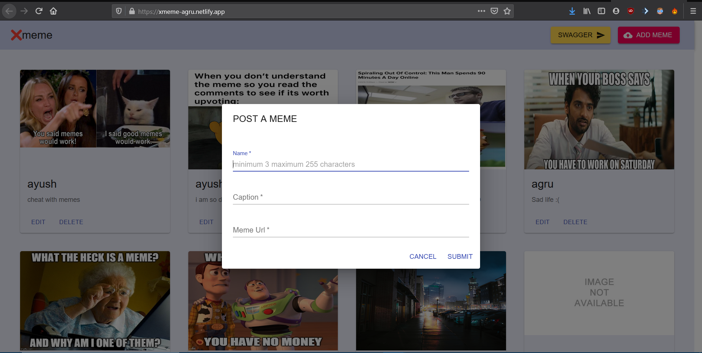

# Xmeme
share your memes with the world

It is an image hosting site.



# Features
* Frontend is made using material-ui and the tamplates of components is also taken from the material-ui site.
* Infinte scroll component for scrolling and pagination present. 
* Requests implemented in the backend- GET, POST, PATCH, DELETE
* Backend uses MongoDB Atlas for Database, but the repo code uses local database.

## Technical Stack

|                  UI Library                   |                   Styling                    |              Backend Framework               |                   Database                   |
| :-------------------------------------------: | :------------------------------------------: | :------------------------------------------: | :------------------------------------------: |
|  |  |  | |

## Build Guide

For Linux distros given script file, install.sh can be run to install all the necessary things.

Otherwise first install node and npm, than install,configure and start mongodb service.

```bash
git clone https://github.com/AGRU13/Xmeme.git
```

For backend
```bash
cd backend
npm install
node server.js;
```

For Frontend
```bash
cd frontend
npm install
npm start;
```

frontend link:- https://xmeme-agru.netlify.app/

backend link:- https://xmeme-agru.herokuapp.com/memes

swagger-ui:- https://xmeme-agru.herokuapp.com/api-docs/

### [The frontend is made using create-react-app](https://github.com/facebook/create-react-app#creating-an-app)

